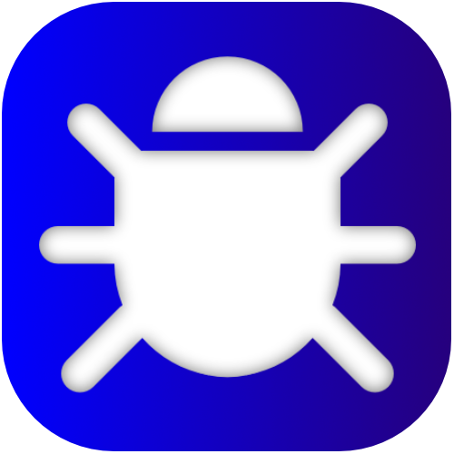
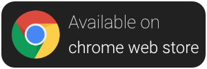
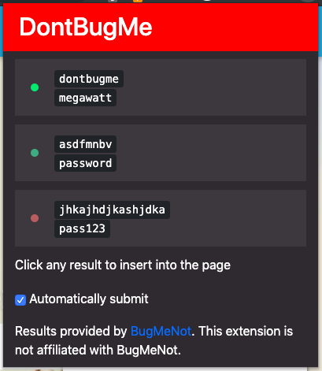

     
    
    

# DontBugMe
DontBugMe is a web browser extension that simplifies the usage of login credentials from [BugMeNot](http://bugmenot.com/).

## Screenshot

## Installation
DontBugMe is availible through the [Firefox Add-On Platform](https://addons.mozilla.org/en-US/firefox/addon/dontbugme/) and [chrome web store](https://chrome.google.com/webstore/detail/dontbugme/mknlnngolpglmlcadgdmlaokbfgppmma).
You can also install this extension on Firefox by downloading the source from GitHub and loading the unpacked extension through "about:debugging" as a "Temporary Add-On".

## Translation
Help us translate DontBugMe into your language by [creating a new issue with your translation](https://github.com/vantezzen/dontbugme/issues/new?assignees=&labels=&template=provide-translation.md&title=%5BTranslation%5D+LANGUAGE).

## Contributing
Please fork this repository and create a new pull request to contribute to it.

If you notice any errors, please create a new issue on GitHub.

## Disclaimer
This extension is not affiliated with BugMeNot. It is developed completely independentely.

