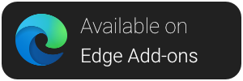

<p align="center">
    <br /><br />
    <a href="https://addons.mozilla.org/en-US/firefox/addon/dontbugme/">
        
    </a>
    <a href="https://chrome.google.com/webstore/detail/dontbugme/mknlnngolpglmlcadgdmlaokbfgppmma">
        
    </a>
    <a href="https://microsoftedge.microsoft.com/addons/detail/dontbugme/fdgmjcnekkpdnoplmkljagijndpddnjb">
        
    </a>
    <a href="https://www.buymeacoffee.com/vantezzen" target="_blank">
        
    </a>
</p>

# DontBugMe

DontBugMe is a web browser extension that simplifies the usage of login credentials from [BugMeNot](http://bugmenot.com/).

## Installation

DontBugMe is available through the [Firefox Add-On Platform](https://addons.mozilla.org/en-US/firefox/addon/dontbugme/) and [chrome web store](https://chrome.google.com/webstore/detail/dontbugme/mknlnngolpglmlcadgdmlaokbfgppmma).
You can also install this extension on Firefox by downloading the source from GitHub and loading the unpacked extension through "about:debugging" as a "Temporary Add-On".

## Development

1. Check if your [Node.js](https://nodejs.org/) version is >= **14**.
2. Clone this repository.
3. Run `npm install` to install the dependencies.
6. Run `npm start`
7. Load your extension on Chrome following:
   1. Access `chrome://extensions/`
   2. Check `Developer mode`
   3. Click on `Load unpacked extension`
   4. Select the `build` folder.
8. Happy hacking.

## Build

To build DontBugMe with WebExtension Manifest v3, simply run
```bash
npm run build
```

As Firefox currently does not support Manifest v3, an alternative build with Manifest v2 can be created using
```bash
npm run build-manifest-v2
```

Please note that in the second case, the manifest version has to be manually updated.

## Contributing
Please fork this repository and create a new pull request to contribute to it.

If you notice any errors, please create a new issue on GitHub.

## Disclaimer
This extension is not affiliated with BugMeNot. It is developed completely independentely.

## Resources:

- Based on [lxieyang's React Extension boilerplate](https://github.com/lxieyang/chrome-extension-boilerplate-react)
- [Webpack documentation](https://webpack.js.org/concepts/)
- [Chrome Extension documentation](https://developer.chrome.com/extensions/getstarted)