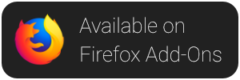
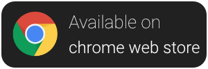

 <p align="center">
    <br /><br />
    <a href="https://addons.mozilla.org/en-US/firefox/addon/dontbugme/">
        
    </a>
    <a href="https://chrome.google.com/webstore/detail/dontbugme/mknlnngolpglmlcadgdmlaokbfgppmma">
        
    </a>
    <a href="https://microsoftedge.microsoft.com/addons/detail/dontbugme/fdgmjcnekkpdnoplmkljagijndpddnjb">
        
    </a>
    <a href="https://www.buymeacoffee.com/vantezzen" target="_blank">
        
    </a>
</p>

# DontBugMe

DontBugMe is a web browser extension that simplifies the usage of login credentials from [BugMeNot](http://bugmenot.com/).

This is a [Plasmo extension](https://docs.plasmo.com/) project bootstrapped with [`plasmo init`](https://www.npmjs.com/package/plasmo).

## Installation

DontBugMe is available through the [Firefox Add-On Platform](https://addons.mozilla.org/en-US/firefox/addon/dontbugme/) and [chrome web store](https://chrome.google.com/webstore/detail/dontbugme/mknlnngolpglmlcadgdmlaokbfgppmma).
You can also install this extension on Firefox by downloading the source from GitHub and loading the unpacked extension through "about:debugging" as a "Temporary Add-On".

## Development

Run the development server:

```bash
pnpm dev
# or
npm run dev
```

Open your browser and load the appropriate development build. For example, if you are developing for the chrome browser, using manifest v3, use: `build/chrome-mv3-dev`.

You can start editing the popup by modifying `popup.tsx`. It should auto-update as you make changes. To add an options page, simply add a `options.tsx` file to the root of the project, with a react component default exported. Likewise to add a content page, add a `content.ts` file to the root of the project, importing some module and do some logic, then reload the extension on your browser.

For further guidance, [visit the Plasmo docs](https://docs.plasmo.com/)

## Build

Run the following:

```bash
pnpm build
# or
npm run build
```

This should create a production bundle for your extension, ready to be zipped and published to the stores.

## Contributing
Please fork this repository and create a new pull request to contribute to it.

If you notice any errors, please create a new issue on GitHub.

## Disclaimer
This extension is not affiliated with BugMeNot. It is developed completely independentely.

